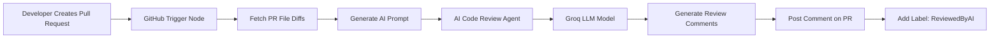

# AI-Powered Pull Request Review System

### Automated Code Review using n8n • Groq LLM • GitHub API

<p align="center">


&nbsp;&nbsp;&nbsp;


&nbsp;&nbsp;&nbsp;


&nbsp;&nbsp;&nbsp;


</p>

---

# 📌 Project Overview

This project implements an **AI-powered automated Pull Request review system** using **n8n workflow automation** integrated with **Groq LLM** and the **GitHub API**.

The workflow automatically analyzes code changes in a Pull Request and generates **intelligent review comments**, similar to what a senior developer would provide.

The system is designed to improve:

* Code quality
* Developer productivity
* Continuous Integration workflows
* AI-assisted software development

---

# 🎯 Key Features

✔ Automated PR code review
✔ AI-generated inline comments
✔ Pull request diff analysis
✔ Automatic GitHub comment posting
✔ Automatic PR labeling
✔ Optional coding standards integration via Google Sheets
✔ LLM-powered intelligent analysis

---

# 🧠 Technologies Used

| Technology        | Role                                    |
| ----------------- | --------------------------------------- |
| **n8n**           | Workflow automation engine              |
| **GitHub API**    | Pull request events and comment posting |
| **Groq LLM**      | AI inference platform                   |
| **LLaMA 3.1**     | Language model used for code review     |
| **Google Sheets** | Optional coding guidelines database     |
| **JavaScript**    | Diff parsing and prompt generation      |

---

# 🏗 System Architecture



---

# ⚙ Workflow Pipeline

The workflow consists of **multiple interconnected nodes inside n8n**, each performing a specific task.

---

# 1️⃣ GitHub Trigger Node

The workflow begins when a **Pull Request event** occurs.

### Configuration

Repository:

```
Owner: PriyanshuKSharma
Repository: multi-cloud
Event: pull_request
```

### Purpose

* Detect Pull Request events
* Capture PR metadata
* Start the automation workflow

---

# 2️⃣ Fetch Pull Request Diffs

The **HTTP Request node** retrieves the modified files and their diffs.

### GitHub API Endpoint

```
https://api.github.com/repos/{{$json.body.sender.login}}/{{$json.body.repository.name}}/pulls/{{$json.body.number}}/files
```

### Data Retrieved

| Field     | Description             |
| --------- | ----------------------- |
| filename  | Name of modified file   |
| patch     | Code difference         |
| additions | Number of added lines   |
| deletions | Number of removed lines |
| status    | File modification type  |

This information is used to analyze **exact code changes introduced by the PR**.

---

# 3️⃣ Generate Prompt from Code Diffs

The **Code Node (JavaScript)** processes the retrieved diffs and converts them into an AI prompt.

### Key Responsibilities

* Parse file diffs
* Format code patches
* Remove formatting conflicts
* Generate structured AI prompt

### Example Prompt

```
You are a senior Web developer working on a multi cloud orchestrator.

Please review the following code changes.

Your mission:
- Review file modifications
- Generate inline comments
- Ignore files without patches
- Do not repeat code snippets
```

This prompt instructs the LLM to behave like an **experienced developer performing code review**.

---

# 4️⃣ AI Code Review Agent

The **LangChain Agent Node** processes the prompt and sends it to the AI model.

Responsibilities include:

* Understanding code structure
* Detecting logical errors
* Identifying potential bugs
* Suggesting improvements
* Producing structured review comments

The AI acts like a **virtual senior developer**.

---

# 5️⃣ Groq LLM Integration

The workflow uses the **Groq Chat Model** for inference.

### Model

```
llama-3.1-8b-instant
```

### Why Groq?

Groq provides:

⚡ Ultra-fast inference
⚡ Low latency responses
⚡ High throughput AI processing

This allows the workflow to generate **near real-time PR reviews**.

---

# 6️⃣ Google Sheets Coding Standards (Optional)

The workflow can integrate **team coding guidelines stored in Google Sheets**.

Example rules:

| Rule              | Description                     |
| ----------------- | ------------------------------- |
| Naming Convention | snake_case for Python variables |
| Logging           | API endpoints must log requests |
| Security          | Validate all inputs             |
| Error Handling    | Avoid empty exception handlers  |

The AI can reference these rules when reviewing code.

---

# 7️⃣ Post AI Review Comment

After the review is generated, the workflow posts it to GitHub.

### GitHub Node Configuration

```
Resource: review
Event: comment
```

Example output:

```
⚠ Potential issue detected:

The API request lacks proper exception handling.

Recommendation:
Wrap the request inside a try/except block.
```

---

# 8️⃣ Add Label to Pull Request

Finally, the workflow adds a label to the Pull Request.

### Label Applied

```
ReviewedByAI(n8n)
```

### Benefits

* Indicates automated review completion
* Helps maintain PR workflow visibility
* Improves collaboration transparency

---

# 🔄 Complete Workflow Example

1️⃣ Developer opens Pull Request
2️⃣ GitHub triggers n8n workflow
3️⃣ Workflow retrieves changed files
4️⃣ Code node builds AI prompt
5️⃣ Groq LLM analyzes code changes
6️⃣ AI generates review feedback
7️⃣ Comment posted to PR
8️⃣ Label **ReviewedByAI(n8n)** added

---

# 🚀 Advantages of This System

✔ Automated developer assistance
✔ Faster feedback cycles
✔ Reduced manual code review workload
✔ Improved code quality
✔ AI-assisted CI/CD pipelines
✔ Enhanced DevOps workflows

---

# 🔮 Future Enhancements

Possible improvements for this project:

* Security vulnerability detection
* Code complexity scoring
* Integration with CI/CD pipelines
* Slack or Discord notifications
* Review analytics dashboard
* Multi-language code support
* Static analysis integration

---

# 📂 Repository

```
https://github.com/PriyanshuKSharma/multi-cloud
```

---

# 👨‍💻 Author

**Priyanshu Kumar Sharma**

Cloud & AI Systems Enthusiast

Areas of Interest:

* Multi-Cloud Architecture
* DevOps Automation
* AI-assisted Software Engineering
* Cloud-Native Systems

---

⭐ If you found this project useful, consider **starring the repository**.
