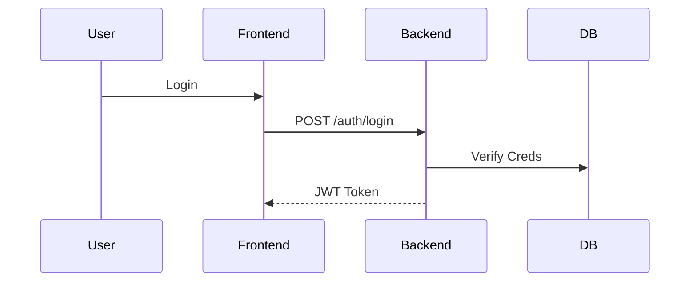
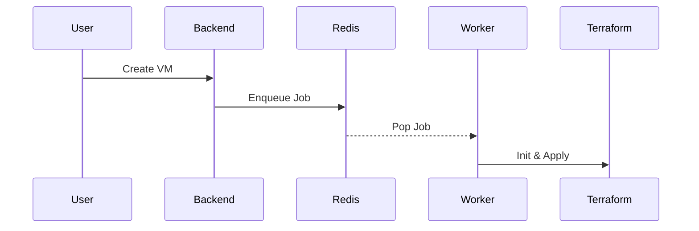
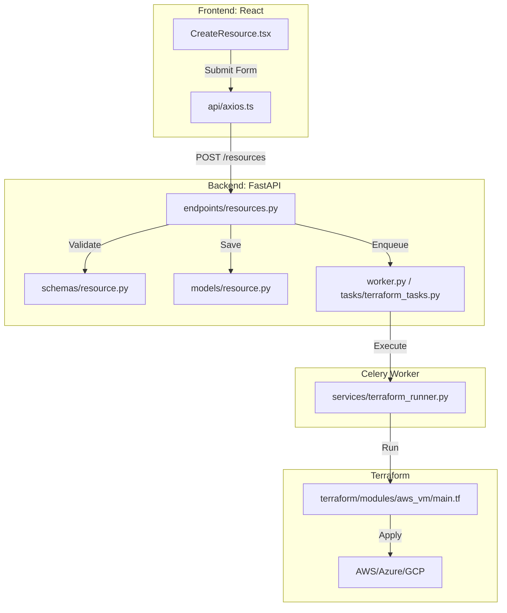

# Multi-Cloud SaaS Orchestration Platform

A Multi-Cloud SaaS Orchestration Platform that allows users to provision Virtual Machines and Object Storage across AWS, Azure, and GCP using Terraform as the backend engine.

## 🏗 Architecture

### High-Level Overview

The system consists of three main components:

1. **Frontend (Client)**: React + Vite SPA. Handles user interaction, forms, and status display.
2. **Backend (API)**: FastAPI. Orchestrates requests, manages database state, and triggers Terraform jobs.
3. **Infrastructure Engine (Worker)**: Dockerized Terraform runners. Executes Terraform commands in isolated environments.

### Tech Stack

- **Frontend**: React, Vite, Tailwind CSS, React Router, Axios, React Hook Form, Zod, Recharts.
- **Backend**: FastAPI (Python), JWT Auth.
- **Database**: PostgreSQL (Store users, projects, resources).
- **Job Queue**: Redis + Celery (Async Terraform execution).
- **Infrastructure**: Terraform, Docker.
- **State Management**: AWS S3 + DynamoDB (Locking).

## 📂 Project Structure

A detailed breakdown of the monorepo structure:

```text
├── backend/                 # FastAPI Backend Application
│   ├── app/
│   │   ├── api/             # API Route Endpoints
│   │   │   ├── deps.py      # Dependency Injection (Auth, DB)
│   │   │   └── endpoints/   # REST Controllers (Auth, Resources)
│   │   ├── core/            # Core Config (Security, Celery, Encryption)
│   │   ├── db/              # Database Connection & Session
│   │   ├── models/          # SQLAlchemy ORM Models (User, Project, Resource)
│   │   ├── schemas/         # Pydantic Data Schemas
│   │   ├── services/        # Business Logic (Terraform Runner)
│   │   ├── tasks/           # Celery Task Definitions
│   │   └── worker.py        # Celery Worker Entrypoint
│   ├── main.py              # Application Entrypoint
│   ├── requirements.txt     # Python Dependencies
│   └── Dockerfile           # Backend Container Definition
│
├── frontend/                # React + Vite Frontend Application
│   ├── src/
│   │   ├── api/             # Axios Setup & API Calls
│   │   ├── components/      # UI Components (Charts, Forms, Lists)
│   │   ├── context/         # React Context (Auth State)
│   │   ├── pages/           # Page Views (Login, Dashboard)
│   │   └── App.tsx          # Main Component & Routing
│   ├── tailwind.config.js   # Styling Configuration
│   └── vite.config.ts       # Build Configuration
│
├── terraform/               # Infrastructure as Code
│   └── modules/             # Reusable Terraform Modules
│       ├── aws_vm/          # AWS EC2 Provisioning
│       ├── aws_s3/          # AWS S3 Bucket
│       ├── azure_vm/        # Azure Virtual Machine
│       ├── azure_blob/      # Azure Blob Storage
│       ├── gcp_vm/          # Google Compute Engine
│       └── gcp_storage/     # Google Cloud Storage
│
├── docker-compose.yml       # Orchestration for DB, Redis, Backend
└── README.md                # Documentation
```

### Workflow

1. **User Action**: User selects resource (e.g., AWS EC2) on Frontend.
2. **API**: Backend accepts request, saves to DB (Pending), pushes job to Redis.
3. **Worker**: Celery worker picks job, triggers Dockerized Terraform runner.
4. **Terraform**: Init -> Plan -> Apply. State stored in S3.
5. **Completion**: Updates DB with Public IP/ID. Frontend reflects status.

## 🚀 Roadmap

### Phase 1: Project Initialization

- [x] Scaffolding Repository Structure (Monorepo)
- [x] Initialize React App
- [x] Initialize FastAPI App
- [x] Set up Terraform Modules standards

### Phase 2: Authentication & User Management

- [x] Implement JWT Auth
- [x] Create Login/Signup UI
- [x] Secure Vault integration (AES Encryption)

### Phase 3: Infrastructure Engine

- [ ] Dockerized Terraform Runner
- [ ] Job Queue (Celery + Redis)
- [ ] Terraform Modules (AWS, Azure, GCP)

### Phase 4: Resource Provisioning

- [ ] Backend APIs for Provisioning
- [ ] Frontend Forms & Validation
- [ ] End-to-end Provisioning Flow

### Phase 5: State & Monitoring

- [ ] State Locking
- [ ] Resource Dashboard
- [ ] Cost Visualization

## 📊 Workflows

### Authentication



### Provisioning (Use Case)



### 4. Code-Level Execution Flow

This diagram maps the user action to specific code files.


