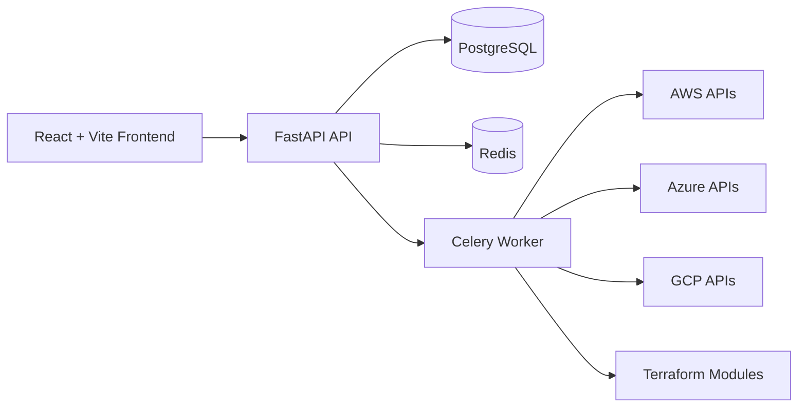

# Nebula: Unified Multi-Cloud Orchestration Platform

<p align="center">
  
  
  
  
  
  
  
  
  
  
</p>

<p align="center">
  
  
  
  
  
  
  
</p>

Nebula is a full-stack multi-cloud orchestration platform for managing infrastructure across AWS, Azure, and GCP from one interface. It combines cloud inventory sync, Terraform-based provisioning, deployment tracking, and cost analytics in a single API-first system.

## Why Nebula

- Unified inventory for virtual machines, storage resources, and networks across AWS, Azure, and GCP
- Secure cloud credential vault with encrypted storage
- Terraform-backed provisioning workflows for VM and storage resources
- Deployment lifecycle visibility with logs and status tracking
- Cost analytics endpoints and dashboard metrics
- Background resource synchronization via Celery workers
- Modern React UI with route-level pages for resources, projects, deployments, billing, blueprints, and account settings

## Architecture



Core backend routers:

- `auth`, `credentials`, `dashboard`, `inventory`, `billing`
- `resources`, `projects`, `deployments`, `blueprints`

## Quick Start (Docker)

### Prerequisites

- Docker
- Docker Compose
- Cloud credentials for one or more providers (AWS, Azure, GCP)

### 1) Clone and configure

```bash
git clone https://github.com/PriyanshuKSharma/multi-cloud.git
cd multi-cloud
cp .env.example .env
```

### 2) Start the stack

```bash
docker compose up -d --build
```

This starts:

- `frontend` on `http://localhost:5173`
- `backend` on `http://localhost:8000`
- `db` (PostgreSQL) on port `5432`
- `redis` on port `6379`
- `celery_worker` for async provisioning and sync tasks

### 3) Access the platform

- App: `http://localhost:5173`
- API docs (Swagger): `http://localhost:8000/docs`
- Health check: `http://localhost:8000/health`

### 4) Optional: run scheduler for periodic sync

Periodic sync is configured in Celery tasks. To run the scheduler:

```bash
docker compose run --rm celery_worker celery -A app.worker.celery_app beat --loglevel=info
```

If you do not run Beat, you can still trigger sync manually from the dashboard API:

```bash
curl -X POST http://localhost:8000/dashboard/sync/trigger \
  -H "Authorization: Bearer <ACCESS_TOKEN>"
```

## Cloud Credential Inputs

Create credentials via UI or `POST /credentials/`.

| Provider | Required fields |
| --- | --- |
| AWS | `access_key`, `secret_key`, `region` |
| Azure | `tenant_id`, `client_id`, `client_secret`, `subscription_id` |
| GCP | Service account JSON payload (with project and auth fields) |

## API Surface (Selected)

| Area | Method | Endpoint |
| --- | --- | --- |
| Auth | `POST` | `/auth/register` |
| Auth | `POST` | `/auth/login` |
| Auth | `GET` | `/auth/me` |
| Dashboard | `GET` | `/dashboard/stats` |
| Dashboard | `POST` | `/dashboard/sync/trigger` |
| Inventory | `GET` | `/inventory/vms` |
| Inventory | `GET` | `/inventory/storage` |
| Inventory | `GET` | `/inventory/networks` |
| Billing | `GET` | `/billing/costs` |
| Billing | `GET` | `/billing/summary` |
| Resources | `POST` | `/resources/` |
| Resources | `POST` | `/resources/{resource_id}/vm/start` |
| Resources | `POST` | `/resources/{resource_id}/vm/stop` |
| Resources | `DELETE` | `/resources/{resource_id}/vm` |
| Storage Ops | `GET` | `/resources/{resource_id}/storage/objects` |
| Storage Ops | `POST` | `/resources/{resource_id}/storage/upload` |
| Storage Ops | `GET` | `/resources/{resource_id}/storage/download` |
| Projects | `GET` | `/projects/` |
| Deployments | `GET` | `/deployments/` |
| Blueprints | `GET` | `/blueprints/` |

For complete request/response details, see `docs/API.md`.

## Local Development

### Backend

```bash
cd backend
python -m venv multi-venv
source multi-venv/bin/activate
pip install -r requirements.txt
uvicorn main:app --reload --host 0.0.0.0 --port 8000
```

### Frontend

```bash
cd frontend
npm install
npm run dev -- --host
```

### Celery worker and beat

```bash
cd backend
celery -A app.worker.celery_app worker --loglevel=info
celery -A app.worker.celery_app beat --loglevel=info
```

### Basic API smoke test

```bash
./test_apis.sh
```

## Repository Layout

```text
multi-cloud/
|-- backend/
|   |-- app/
|   |   |-- api/endpoints/
|   |   |-- core/
|   |   |-- db/
|   |   |-- models/
|   |   |-- schemas/
|   |   |-- services/
|   |   `-- tasks/
|   |-- main.py
|   `-- requirements.txt
|-- frontend/
|   |-- src/
|   |   |-- components/
|   |   |-- context/
|   |   |-- pages/
|   |   `-- api/
|   `-- package.json
|-- terraform/modules/
|-- docs/
|-- docker-compose.yml
`-- docker-compose.prod.yml
```

## Documentation

- `docs/INDEX.md`
- `docs/README.md`
- `docs/API.md`
- `docs/BACKEND.md`
- `docs/CLOUD_PROVIDERS.md`
- `docs/SECURITY.md`
- `DEPLOYMENT.md`
- `DEPLOYMENT_CHECKLIST.md`

## License

This repository is proprietary and distributed under an all-rights-reserved license. See `LICENSE` for details.

## Trademark Note

AWS, Azure, Google Cloud, Docker, Terraform, React, FastAPI, PostgreSQL, Redis, and Celery names/logos are trademarks of their respective owners.
