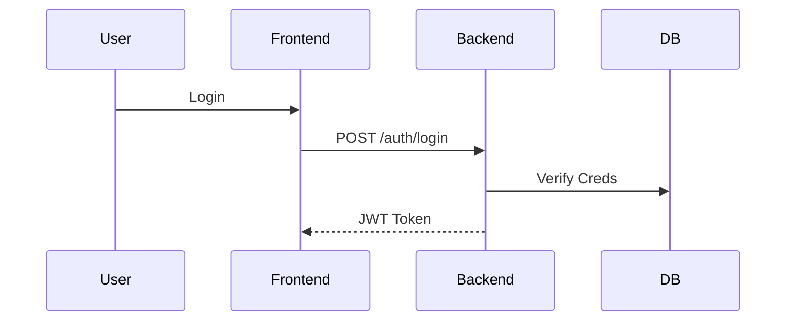
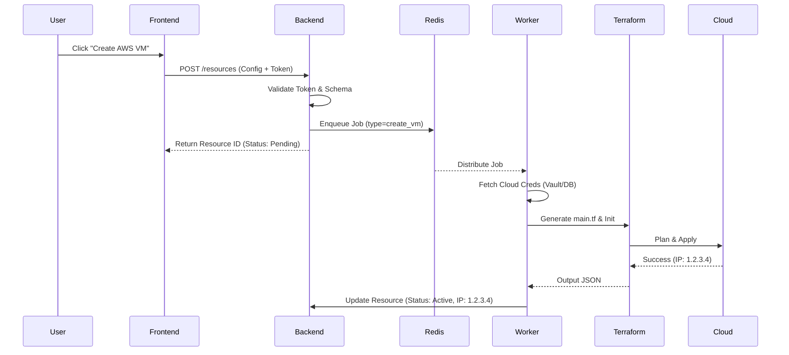
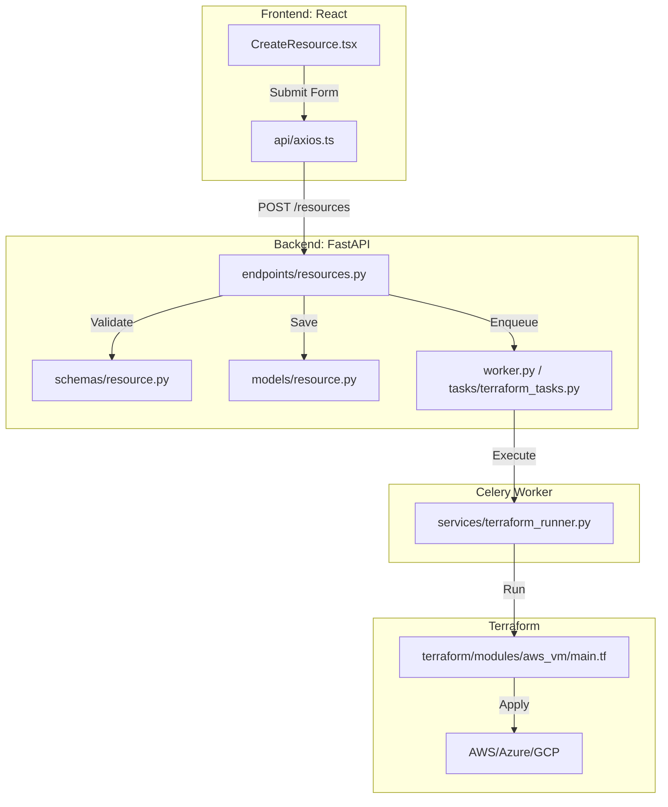

# ☁️ Multi-Cloud SaaS Orchestration Platform

    

> **"Infrastructure at the Speed of Thought"**

A next-generation **Multi-Cloud Orchestration Platform** that unifies AWS, Azure, and GCP into a single, elegant interface. Provision Virtual Machines and Object Storage with a click, monitored by a real-time reactive dashboard, all powered by an invisible Infrastructure-as-Code engine.

---

## 🚀 Innovation Highlights

Only one platform offers this blend of simplicity and power:

- **🛡️ Cloud Agnostic Core**: Decouple your workflow from vendor lock-in. Switch providers with a dropdown click, not a migration team.
- **⚡ Reactive Provisioning Engine**: Built on an event-driven architecture (Celery + Redis) to handle thousands of concurrent provisioning requests without blocking the UI.
- **🔐 Zero-Trust Security**: Cloud credentials are never exposed to the frontend; they are AES-encrypted at rest and injected dynamically into isolated ephemeral runners.
- **👁️ Single Pane of Glass**: A unified dashboard for resource management and cost visualization across all your cloud subscriptions.
- **🤖 AI-Ready Foundation**: Structured data architecture designed for future plugins like _predictive cost analysis_ and _smart resource sizing_.

---

## 📖 Project Overview

### 💡 The Problem

Managing infrastructure across AWS, Azure, and Google Cloud is fragmented. Each has its own console, API, and steep learning curve. Developers spend more time fighting config files than shipping code.

### ✅ The Solution

We treat Cloud Resources like products in a Vending Machine:

1.  **Frontend**: You select what you want (e.g., "AWS EC2 t2.micro").
2.  **Backend**: Validates your credit and request.
3.  **Engine**: The robotic arm (Terraform) automatically provisions it in the cloud.

---

## 🏗 Architecture

### High-Level Ecosystem

```mermaid
graph TD
    subgraph Client
        Browser[User Browser]
    end

    subgraph "Docker Compose Network"
        LB[Reverse Proxy / API Gateway]
        Frontend_Container[React App (Nginx)]
        Backend_Container[FastAPI Backend]
        DB[(PostgreSQL)]
        Redis[(Redis)]
        Worker_Container[Celery Worker]
    end

    subgraph "External Clouds"
        AWS[AWS Cloud]
        Azure[Azure Cloud]
        GCP[Google Cloud]
    end

    Browser -->|HTTP/REST| Backend_Container
    Browser -->|HTTP| Frontend_Container

    Backend_Container -->|Read/Write| DB
    Backend_Container -->|Push Job| Redis

    Worker_Container -->|Pop Job| Redis
    Worker_Container -->|Update Status| DB

    Worker_Container -->|Terraform Apply| AWS
    Worker_Container -->|Terraform Apply| Azure
    Worker_Container -->|Terraform Apply| GCP
```

### Tech Stack

| Component     | Technology                | Role                           |
| ------------- | ------------------------- | ------------------------------ |
| **Frontend**  | React, Vite, Tailwind CSS | Responsive, modern UI/UX       |
| **Backend**   | FastAPI (Python)          | High-performance async API     |
| **Database**  | PostgreSQL                | Relational data persistence    |
| **Broker**    | Redis                     | Message broker for async tasks |
| **Worker**    | Celery                    | Distributed task execution     |
| **Engine**    | Terraform                 | Infrastructure as Code         |
| **Container** | Docker                    | Isolation and portability      |

---

## 📂 Project Structure

```text
├── backend/                 # 🧠 FastAPI Brain
│   ├── app/
│   │   ├── api/             # REST Endpoints
│   │   ├── core/            # Security & Config
│   │   ├── models/          # DB Schemas
│   │   ├── services/        # Logic Layer
│   │   ├── tasks/           # Async Tasks
│   │   └── worker.py        # Worker Entrypoint
│
├── frontend/                # 💅 React Face
│   ├── src/
│   │   ├── components/      # Reusable UI
│   │   ├── pages/           # Route Views
│   │   └── context/         # Global State
│
├── terraform/               # 🏗️ Infrastructure Modules
│   └── modules/             # AWS/Azure/GCP definitions
│
├── docker-compose.yml       # 🎼 Orchestration
└── README.md                # 📘 Documentation
```

---

## 🔄 workflows

### 1. Authentication Flow

Secure, standards-compliant JWT authentication.



### 2. The Provisioning Lifecycle

From User Click to Cloud Resource.



### 3. Code-Level Trace

Where the magic happens in the codebase.



---

## 🗺️ Roadmap & Status

### ✅ Completed

- [x] **Phase 1**: Monorepo Setup (React + FastAPI + Docker)
- [x] **Phase 2**: Auth System (JWT + Encrypted Storage)
- [x] **Phase 3**: Engine Core (Celery + Redis + Terraform Service)
- [x] **Phase 4**: Provisioning MVP (AWS EC2, S3, Azure VM, GCP Storage)
- [x] **Phase 5**: Monitoring (Cost Charts & Resource Dashboard)

### 🔜 Upcoming

- [ ] **Phase 6**: WebSockets for Live Logs
- [ ] **Phase 7**: Billing Alerts & Budgets
- [ ] **Phase 8**: Kubernetes Cluster Provisioning (EKS/AKS/GKE)

---

## 🛠️ Getting Started

### Prerequisites

- Docker & Docker Compose

### Fast Launch

```bash
# 1. Start Support Services & Backend
docker-compose up -d

# 2. Visit the App
# Frontend: http://localhost:5173
# API Docs: http://localhost:8000/docs
```
