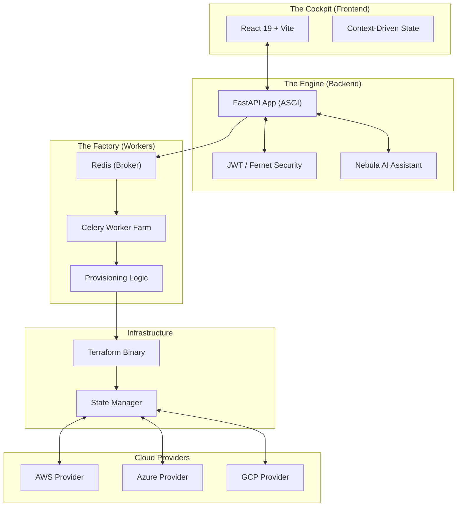
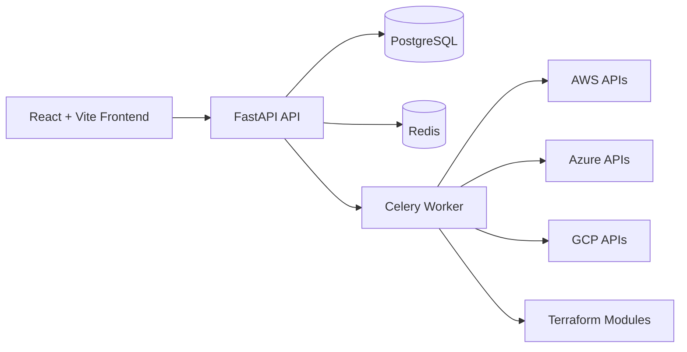

# 🌌 Nebula: The Multi-Cloud Command Center

<p align="center">
  
  
  
  
  
  
  
  
  
  
</p>

<p align="center">
  
  
  
  
  
  
  
  
  
</p>

Nebula is a high-performance, API-first orchestration engine designed to unify the fragmented multi-cloud landscape. It abstracts **AWS, Azure, and GCP** into a single control plane, enabling developers to provision, monitor, and troubleshoot infrastructure without leaving their cockpit.

---

## 🚀 Innovative Features for Modern Devs

### 🤖 Nebula AI Copilot (Built-in)

Troubleshoot deployment failures in real-time. Our integrated AI analyzes Terraform logs and provider errors to provide deterministic findings and one-click remediation steps.

- **Auto-Root Cause Analysis**: Scans `stderr` for IAM, Quota, and Credential issues.
- **Provider-Agnostic Intelligence**: Supports OpenAI, Gemini, Claude, and Custom LLM wrappers.

### 🛡️ Hardened Security Architecture

- **Fernet-Encrypted Vault**: Cloud credentials never touch the DB in plain text. We use AES-128 in CBC mode with HMAC for military-grade protection.
- **OAuth 2.0 & JWT**: Secure session management with role-based access control.

### ⚡ Async Provisioning Engine

Leveraging **Celery + Redis**, Nebula executes resource-intensive Terraform workflows in the background, providing live streaming status updates to the UI via a polling-optimized state machine.

---

## 🎓 Scientific Foundation

Nebula is more than just a tool; it is a peer-reviewed research project exploring the boundaries of cloud orchestration and infrastructure-as-code.

> [!NOTE] > **Research Paper:** _Nebula: A Multi-Cloud Provisioning and Orchestration Engine_ > **Published in:** International Journal of Creative Research Thoughts (IJCRT)
> **Volume:** 14 | **Issue:** 4 | **Date:** April 2026
>
> 🔗 [View Full Paper](http://www.ijcrt.org/viewfull.php?&p_id=IJCRT2604384) | 📄 [DOI: 10.56975/ijcrt.v14i4.305033](https://doi.org/10.56975/ijcrt.v14i4.305033)

---

## 🏗️ System Architecture


```mermaid
flowchart TD
    subgraph "The Cockpit (Frontend)"
        UI["React 19 + Vite"]
        Store["Context-Driven State"]
    end

    subgraph "The Engine (Backend)"
        API["FastAPI App (ASGI)"]
        Guard["JWT / Fernet Security"]
        Copilot["Nebula AI Assistant"]
    end

    subgraph "The Factory (Workers)"
        Redis["Redis (Broker)"]
        Queue["Celery Worker Farm"]
        Logic["Provisioning Logic"]
    end

    subgraph "Cloud Providers"
        AWS["AWS Provider"]
        AZ["Azure Provider"]
        GCP["GCP Provider"]
    end

    subgraph "Infrastructure"
        TF["Terraform Binary"]
        State["State Manager"]
    end

    UI <--> API
    API <--> Guard
    API <--> Copilot
    API --> Redis
    Redis --> Queue
    Queue --> Logic
    Logic --> TF
    TF --> State
    State <--> AWS & AZ & GCP
```


```mermaid
flowchart LR
    UI[React + Vite Frontend] --> API[FastAPI API]
    API --> PG[(PostgreSQL)]
    API --> REDIS[(Redis)]
    API --> CW[Celery Worker]
    CW --> AWS[AWS APIs]
    CW --> AZ[Azure APIs]
    CW --> GCP[GCP APIs]
    CW --> TF[Terraform Modules]
```

Core backend routers:

- `auth`, `credentials`, `dashboard`, `inventory`, `billing`
- `resources`, `projects`, `deployments`, `blueprints`

---

## 🛠️ Developer Interface (API Core)

Nebula is API-first. Every UI action is backed by a RESTful endpoint.

| Capability    | Method | Endpoint                  | Use Case                                 |
| :------------ | :----- | :------------------------ | :--------------------------------------- |
| **Cognition** | `POST` | `/assistant/query`        | Ask AI to troubleshoot a resource        |
| **Sync**      | `POST` | `/dashboard/sync/trigger` | Force cloud inventory refresh            |
| **Provision** | `POST` | `/resources/`             | Initiate Terraform workflow              |
| **Inventory** | `GET`  | `/inventory/vms`          | List cross-cloud virtual machines        |
| **Health**    | `GET`  | `/health`                 | Check service & background worker status |

---

## 🏎️ Rapid Deployment

### Initial Launch

```bash
git clone https://github.com/PriyanshuKSharma/multi-cloud.git
cp .env.example .env
docker compose up -d --build
```

### Smoke Test

Validate your installation instantly:

```bash
./scripts/test_apis.sh
```

---

## 📂 Engineering Layout

## Repository Layout

```text
multi-cloud/
|-- backend/
|   |-- app/
|   |   |-- api/endpoints/
|   |   |-- core/
|   |   |-- db/
|   |   |-- models/
|   |   |-- schemas/
|   |   |-- services/
|   |   `-- tasks/
|   |-- main.py
|   `-- requirements.txt
|-- frontend/
|   |-- src/
|   |   |-- components/
|   |   |-- context/
|   |   |-- pages/
|   |   `-- api/
|   `-- package.json
|-- terraform/modules/
|-- docs/
|-- scripts/
|-- docker-compose.yml
`-- docker-compose.prod.yml
```

---

## 🗺️ Roadmap & Beyond

- [ ] Support for **Kubernetes Cluster Provisioning**.
- [ ] **AI Forecasting**: Predictive cost analysis based on usage patterns.
- [ ] **Drift Detection**: Automatic remediation of manual cloud changes.

---

### ⚖️ Legal & Trademarks

Distributed under a **Proprietary All-Rights-Reserved License**. See [LICENSE](LICENSE) and [NOTICE](NOTICE).
AWS, Azure, GCP, and other third-party marks are the property of their respective owners.
