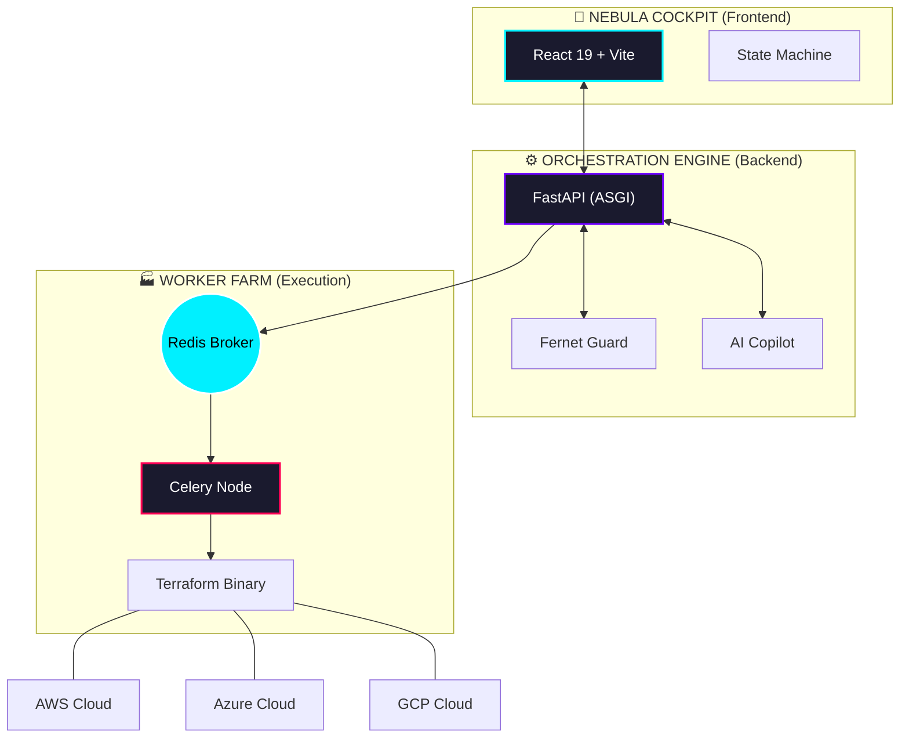
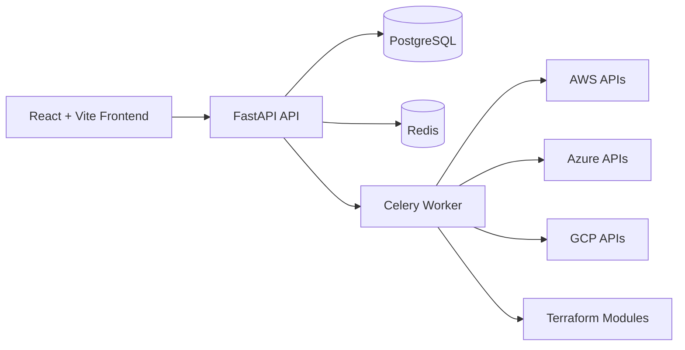

# 🌌 Nebula: The Multi-Cloud Command Center

<p align="center">
  
</p>

<p align="center">
  
  
</p>

<p align="center">
  
  
  
</p>

---

## 📖 Project Manifesto

### **The Multi-Cloud Challenge**
As enterprises scale, infrastructure becomes fragmented across AWS, Azure, and GCP. Managing different consoles, creditial types, and billing models leads to **operational drift**, **security gaps**, and **cost transparency issues**.

### **The Nebula Solution**
Nebula is a research-driven, high-performance orchestration engine designed to democratize cloud operations. It provides a **Unified Control Plane** that abstracts complex provider APIs into a deterministic, single-pane-of-glass interface. 

<p align="center">
  
</p>


> *Nebula isn't just a dashboard—it's a mission-critical cockpit for the modern cloud architect.*

---

## 🚀 Innovative Features

### 🤖 **AI Copilot (Built-in Cognition)**
Never debug a "Terraform Apply" failure alone. Our integrated AI analyzes execution logs and cloud provider errors in real-time to provide:
- **Auto-Root Cause Analysis**: Identifies IAM, Quota, and Network conflicts.
- **One-Click Remediation**: Suggests valid configuration fixes based on provider-specific logic.

### 🛡️ **Military-Grade Security**
- **Credential Isolation**: Cloud secrets are encrypted using **Fernet AES-128 (CBC mode)** with HMAC. Plaintext keys never touch the persistence layer.
- **Stateless Authentication**: Hardened OAuth 2.0 and JWT implementation for secure cross-service communication.

### ⚡ **High-Concurrency Engine**
Leveraging a **Distributed Task Farm (Celery + Redis)**, Nebula manages resource-intensive cloud workflows in the background. A polling-optimized state machine provides live pulse updates to the React 19 UI.

---

## 🛠️ The Tech Arsenal

<div align="center">

| **Frontend** | **Backend** | **Infrastructure** | **DevOps** |
| :--- | :--- | :--- | :--- |
|  |  |  |  |
|  |  |  |  |
|  |  |  |  |
| |  | | |

</div>

### **Deep-Dive: The Nebula Tech Arsenal (Technical Details)**

#### **🎨 Frontend: The Cockpit**
- **⚛️ React 19 & Vite**: nebula leverages **React 19's concurrent rendering** capabilities to maintain a responsive UI during heavy data synchronization. **Vite** is utilized for its Lightning-fast Hot Module Replacement (HMR) and optimized build pipeline, ensuring a frictionless developer experience.
- **💅 Tailwind CSS & Framer Motion**: Provides a highly-customizable design system with **glassmorphism** aesthetics. We use Framer Motion for micro-animations that signal state changes from the multi-cloud backend.

#### **⚙️ Backend: The Orchestration Engine**
- **⚡ FastAPI (Python 3.11+)**: Chosen for its native **async/await** support and Pydantic-driven data validation. It acts as the ASGI entry point, providing high-concurrency handling for cloud resource management and AI interactions.
- **🧠 AI Copilot Core**: A specialized module that interfaces with LLMs (OpenAI/Gemini) to perform **log-semantic analysis**. It translates cryptic Terraform or Cloud Provider errors into human-understandable remediation paths.

#### **🏭 Async & Background Logic**
- **⚙️ Celery & Redis**: Nebula implements a **distributed task worker architecture**. Redis serves as a high-speed message broker, while Celery handles periodic cloud inventory synchronization (via Celery Beat) and idempotent infrastructure provisioning tasks.
- **🚄 Real-time State Polling**: Instead of static loads, the frontend implements an **optimized polling state machine** that communicates with the Backend to reflect the live status of background provisioning.

#### **🐘 Persistence & Security**
- **📊 PostgreSQL 15**: The primary relational engine. It stores complex cloud resource topologies, deployment history, and user metadata with optimized indexing for cross-cloud inventory searches.
- **🛡️ Fernet AES-128 Guard**: A security-first implementation where cloud provider credentials (API Keys, Secrets) are **encrypted at the application layer** before storage. We utilize salted CBC mode with HMAC for integrity verification.

#### **🏗️ Infrastructure & DevOps**
- **🏗️ Terraform (v1.5+)**: The core IaC engine. Nebula dynamically generates Terraform configuration files, manages **tfstate** files within a secured backend, and streams execution logs directly to the UI.
- **🐋 Docker & Compose**: Ensures environment parity across "Dev, Stage, and Prod". The entire stack is containerized, facilitating rapid deployment and consistent behavior across different host environments.

---

## 🏗️ Technical Architecture


```mermaid
graph TD
    subgraph "🌌 NEBULA COCKPIT (Frontend)"
        UI["React 19 + Vite"]
        Store["State Machine"]
    end

    subgraph "⚙️ ORCHESTRATION ENGINE (Backend)"
        API["FastAPI (ASGI)"]
        Guard["Fernet Guard"]
        AI["AI Copilot"]
    end

    subgraph "🏭 WORKER FARM (Execution)"
        Redis(("Redis Broker"))
        Worker["Celery Node"]
        TF["Terraform Binary"]
    end

    UI <--> API
    API <--> Guard
    API <--> AI
    API --> Redis
    Redis --> Worker
    Worker --> TF
    
    TF --- AWS["AWS Cloud"]
    TF --- AZ["Azure Cloud"]
    TF --- GCP["GCP Cloud"]

    style UI fill:#1a1a2e,stroke:#00f0ff,stroke-width:2px,color:#fff
    style API fill:#1a1a2e,stroke:#7000ff,stroke-width:2px,color:#fff
    style Worker fill:#1a1a2e,stroke:#ff0055,stroke-width:2px,color:#fff
    style Redis fill:#00f0ff,stroke:#fff,stroke-width:2px,color:#000
```



```mermaid
flowchart LR
    UI[React + Vite Frontend] --> API[FastAPI API]
    API --> PG[(PostgreSQL)]
    API --> REDIS[(Redis)]
    API --> CW[Celery Worker]
    CW --> AWS[AWS APIs]
    CW --> AZ[Azure APIs]
    CW --> GCP[GCP APIs]
    CW --> TF[Terraform Modules]
```

Core backend routers:

- `auth`, `credentials`, `dashboard`, `inventory`, `billing`
- `resources`, `projects`, `deployments`, `blueprints`

---

## 🏁 Execution Protocol (Launch)

```bash
# 1. Initialize the Mainframe
git clone https://github.com/PriyanshuKSharma/multi-cloud.git
cp .env.example .env

# 2. Deploy via Docker
docker compose up -d --build

# 3. Synchronize Cloud Inventory
./scripts/test_apis.sh
```

---

## 🗂️ Engineering Layout

```text
multi-cloud/
├── 🧠 backend/         # FastAPI, Celery, AI Logic
├── 🎨 frontend/        # React 19, Tailwind, Context
├── 🏗️ terraform/       # Provider Modules
├── 📜 docs/            # Technical Specifications
└── 🛠️ scripts/          # Automation & Diagnostics
```

---

## 🗺️ Future Protocol (Roadmap)
- [ ] **K8s Nexus**: Automated Kubernetes Cluster Provisioning across Hybrid Clouds.
- [ ] **Cost Forecasting**: Predictive ML models for usage and billing patterns.
- [ ] **Dynamic Drift Detection**: Automatic remediation of manual out-of-band changes.

---

### ⚖️ Legal & Trademarks
Distributed under a **Proprietary All-Rights-Reserved License**. See [LICENSE](LICENSE) and [NOTICE](NOTICE).
AWS, Azure, GCP, and other third-party marks are the property of their respective owners.

<p align="right">
  <i>Maintained by the Nebula Core Team</i>
</p>
