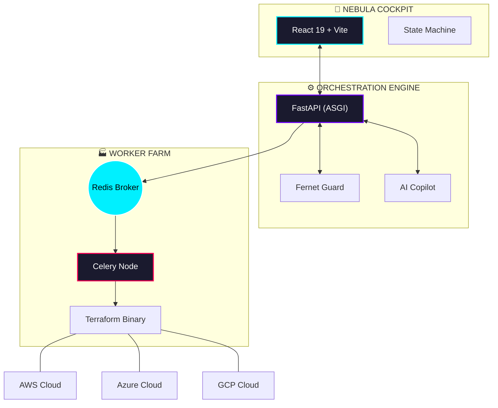

# 🌌 Nebula: The Multi-Cloud Command Center

<p align="center">
  
</p>


<p align="center">
  
  
</p>

<p align="center">
  
  
  
</p>

<p align="center">
  
</p>
---

### 📡 **Terminal Connection Established...**

> **Nebula** is a high-performance orchestration engine designed to unify the fragmented multi-cloud landscape. It abstracts **AWS, Azure, and GCP** into a single control plane, enabling developers to provision, monitor, and troubleshoot infrastructure without leaving their cockpit.

---

## 🚀 Innovative Features

| 🤖 AI Copilot                                                               | 🛡️ Secure Vault                                                            | ⚡ Async Engine                                                          |
| :-------------------------------------------------------------------------- | :------------------------------------------------------------------------- | :----------------------------------------------------------------------- |
| Real-time troubleshooting using integrated LLMs for deterministic findings. | Fernet-encrypted credentials. Keys never touch the database in plain text. | Background execution via Celery + Redis with live-polling state updates. |

<details>
<summary><b>View Advanced Technical Specs</b></summary>

- **Auto-Root Cause Analysis**: Scans `stderr` for IAM, Quota, and Credential issues.
- **Provider-Agnostic Intelligence**: Supports OpenAI, Gemini, Claude, and Custom LLM wrappers.
- **OAuth 2.0 & JWT**: Secure session management with role-based access control.
- **Encrypted Storage**: AES-128 in CBC mode with HMAC for military-grade protection.

</details>

---

## 🏗️ System Architecture


```mermaid
graph TD
    subgraph "🌌 NEBULA COCKPIT"
        UI["React 19 + Vite"]
        Store["State Machine"]
    end

    subgraph "⚙️ ORCHESTRATION ENGINE"
        API["FastAPI (ASGI)"]
        Guard["Fernet Guard"]
        AI["AI Copilot"]
    end

    subgraph "🏭 WORKER FARM"
        Redis(("Redis Broker"))
        Worker["Celery Node"]
        TF["Terraform Binary"]
    end

    UI <--> API
    API <--> Guard
    API <--> AI
    API --> Redis
    Redis --> Worker
    Worker --> TF

    TF --- AWS["AWS Cloud"]
    TF --- AZ["Azure Cloud"]
    TF --- GCP["GCP Cloud"]

    style UI fill:#1a1a2e,stroke:#00f0ff,stroke-width:2px,color:#fff
    style API fill:#1a1a2e,stroke:#7000ff,stroke-width:2px,color:#fff
    style Worker fill:#1a1a2e,stroke:#ff0055,stroke-width:2px,color:#fff
    style Redis fill:#00f0ff,stroke:#fff,stroke-width:2px,color:#000
```

---

## 🏁 Execution Protocol (Launch)

```bash
# Initialize the Mainframe
git clone https://github.com/PriyanshuKSharma/multi-cloud.git
cp .env.example .env

# Deploy via Docker Swarm/Compose
docker compose up -d --build

# Run Deep Health Diagnostics
./scripts/test_apis.sh
```

---

## 🗂️ Engineering Layout

```text
multi-cloud/
├── 🧠 backend/         # FastAPI, Celery, AI Logic
├── 🎨 frontend/        # React 19, Tailwind, Context
├── 🏗️ terraform/       # Provider Modules
├── 📜 docs/            # Technical Specifications
└── 🛠️ scripts/          # Automation & Diagnostics
```

---

## 🗺️ Future Protocol (Roadmap)

- [ ] **K8s Nexus**: Automated Kubernetes Cluster Provisioning.
- [ ] **Cost Forecasting**: Predictive analysis based on usage patterns.
- [ ] **Dynamic Drift Detection**: Automatic remediation of manual cloud changes.

---

### ⚖️ Legal & Trademarks

Distributed under a **Proprietary All-Rights-Reserved License**. See [LICENSE](LICENSE) and [NOTICE](NOTICE).
AWS, Azure, GCP, and other third-party marks are the property of their respective owners.

<p align="right">
  <i>Maintained by the Nebula Core Team</i>
</p>
