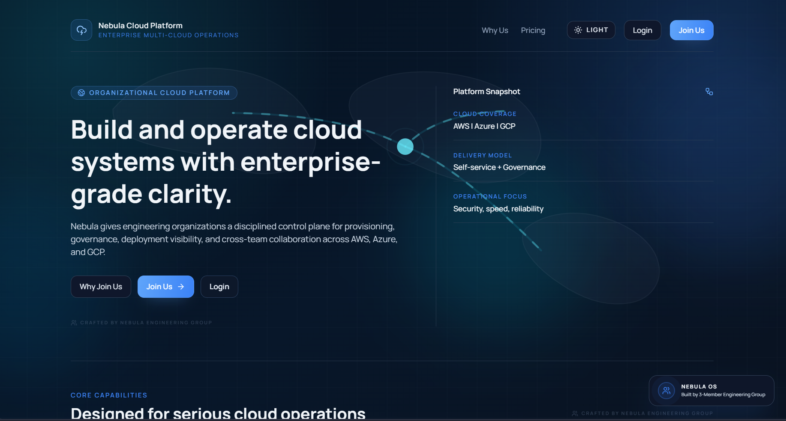
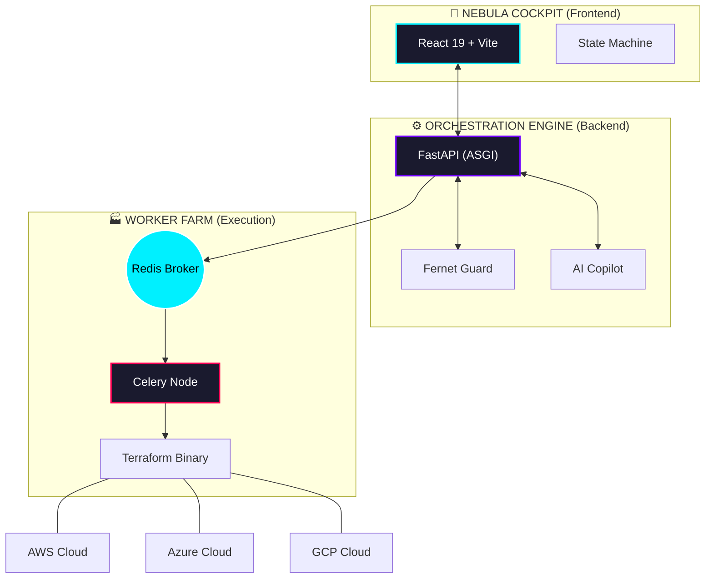
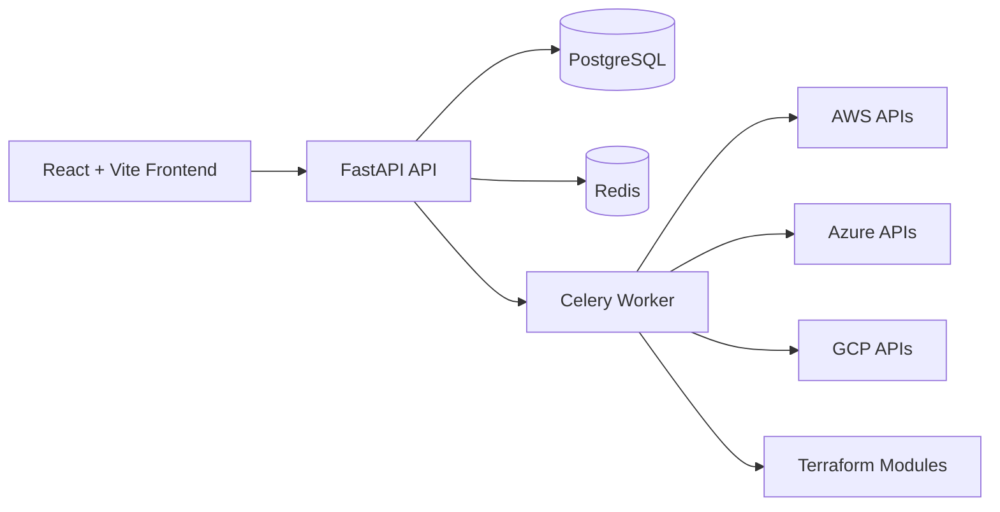

# 🌌 Nebula: The Multi-Cloud Command Center

<p align="center">
  
</p>

<p align="center">
  
  
</p>

<p align="center">
  
  
  
  
  
  
  
</p>

---

## 📖 Project Manifesto

### **The Multi-Cloud Challenge**

As enterprises scale, infrastructure becomes fragmented across AWS, Azure, and GCP. Managing different consoles, credential types, and billing models leads to **operational drift**, **security gaps**, and **cost transparency issues**.

### **The Nebula Solution**

Nebula is a research-driven, high-performance orchestration engine designed to democratize cloud operations. It provides a **Unified Control Plane** that abstracts complex provider APIs into a deterministic, single-pane-of-glass interface.

<p align="center">
  
</p>

> _Nebula isn't just a dashboard—it's a mission-critical cockpit for the modern cloud architect._



> **Figure 1: Nebula Command Center Interface**

---

## 👥 Engineering Team

Nebula is built and maintained by a dedicated engineering group from **Ajeenkya D Y Patil University**.

<div align="center">

|                                                                                       **Priyanshu Kumar Sharma**                                                                                        |                                            **Vaishnavi Jadhav**                                            |                                         **Vaibhav Gulge**                                         |
| :-----------------------------------------------------------------------------------------------------------------------------------------------------------------------------------------------------: | :--------------------------------------------------------------------------------------------------------: | :-----------------------------------------------------------------------------------------------: |
|                                                                                                                         |                   |                |
|                                                                                   **Product, Platform & Infra Lead**                                                                                    |                                         **Frontend & UX Engineer**                                         |                                    **Frontend & UX Engineer**                                     |
|                                                                    Platform architecture, cloud systems, & provisioning automation.                                                                     |                         Interface systems, workflow design, & operator experience.                         |                    Interface systems, workflow design, & operator experience.                     |
| [GitHub](https://github.com/PriyanshuKSharma) • [LinkedIn](https://www.linkedin.com/in/priyanshu-kumar-sharma-333800251/) • [Portfolio](https://priyanshuksharma.github.io/portfolio_priyanshuksharma/) | [GitHub](https://github.com/vaish105) • [LinkedIn](https://www.linkedin.com/in/vaishnavi-jadhav-92bb6635b) | [GitHub](https://github.com/VaibhavGulge) • [LinkedIn](https://www.linkedin.com/in/vaibhav-gulge) |

</div>

---

## 🎓 Scientific Foundation

Nebula is more than just a tool; it is a peer-reviewed research project exploring the boundaries of cloud orchestration and infrastructure-as-code.

> [!NOTE] > **Research Paper:** _Democratizing AWS Cloud Operations: A Unified Orchestration Approach to Standardized Infrastructure Management_ > **Published in:** International Journal of Creative Research Thoughts (IJCRT)
> **Volume:** 14 | **Issue:** 4 | **Date:** April 2026
>
> 🔗 [View Full Paper](http://www.ijcrt.org/viewfull.php?&p_id=IJCRT2604384) | 📄 [DOI: 10.56975/ijcrt.v14i4.305033](https://doi.org/10.56975/ijcrt.v14i4.305033)

---

## 🚀 Innovative Features

### 🤖 **AI Copilot (Built-in Cognition)**

Never debug a "Terraform Apply" failure alone. Our integrated AI analyzes execution logs and cloud provider errors in real-time to provide:

- **Auto-Root Cause Analysis**: Identifies IAM, Quota, and Network conflicts.
- **One-Click Remediation**: Suggests valid configuration fixes based on provider-specific logic.

### 🛡️ **Military-Grade Security**

- **Credential Isolation**: Cloud secrets are encrypted using **Fernet AES-128 (CBC mode)** with HMAC. Plaintext keys never touch the persistence layer.
- **Stateless Authentication**: Hardened OAuth 2.0 and JWT implementation for secure cross-service communication.

### ⚡ **High-Concurrency Engine**

Leveraging a **Distributed Task Farm (Celery + Redis)**, Nebula manages resource-intensive cloud workflows in the background. A polling-optimized state machine provides live pulse updates to the React 19 UI.

---

## 🛠️ The Tech Arsenal

<div align="center">

| **Frontend**                                                                                      | **Backend**                                                                                         | **Infrastructure**                                                                         | **DevOps**                                                                                   |
| :------------------------------------------------------------------------------------------------ | :-------------------------------------------------------------------------------------------------- | :----------------------------------------------------------------------------------------- | :------------------------------------------------------------------------------------------- |
|  |               |           |           |
|    |  |  |  |
|                      |      |         |              |
|                                                                                                   |  |                                                                                            |                                                                                              |

</div>

### **Deep-Dive: Technical Reference**

#### **🎨 Frontend: The Cockpit**

- **React 19 & Vite**: nebula leverages **React 19's concurrent rendering** capabilities to maintain a responsive UI during heavy data synchronization. **Vite** is utilized for its Lightning-fast Hot Module Replacement (HMR) and optimized build pipeline.
- **Tailwind CSS & Framer Motion**: Provides a highly-customizable design system with **glassmorphism** aesthetics and micro-animations for live backend state changes.

#### **⚙️ Backend: The Orchestration Engine**

- **FastAPI (Python 3.11+)**: Chosen for its native **async/await** support and Pydantic-driven data validation. It acts as the ASGI entry point, providing high-concurrency handling for cloud resource management.
- **🧠 AI Copilot Core**: A specialized module that interfaces with LLMs to perform **log-semantic analysis**, translating cryptic Terraform or Cloud Provider errors into human-understandable remediation paths.

#### **🏭 Async & Background Logic**

- **Celery & Redis**: Nebula implements a **distributed task worker architecture**. Redis serves as a high-speed message broker, while Celery handles periodic cloud inventory synchronization and idempotent infrastructure provisioning tasks.

#### **🐘 Persistence & Security**

- **PostgreSQL 15**: The primary relational engine, storing complex cloud resource topologies and deployment history with optimized indexing.
- **🛡️ Fernet AES-128 Guard**: Cloud provider credentials are **encrypted at the application layer** using salted CBC mode with HMAC for integrity verification.

---

## 🏗️ Technical Architecture

### **Data Flow Model**


```mermaid
graph TD
    subgraph "🌌 NEBULA COCKPIT (Frontend)"
        UI["React 19 + Vite"]
        Store["State Machine"]
    end

    subgraph "⚙️ ORCHESTRATION ENGINE (Backend)"
        API["FastAPI (ASGI)"]
        Guard["Fernet Guard"]
        AI["AI Copilot"]
    end

    subgraph "🏭 WORKER FARM (Execution)"
        Redis(("Redis Broker"))
        Worker["Celery Node"]
        TF["Terraform Binary"]
    end

    UI <--> API
    API <--> Guard
    API <--> AI
    API --> Redis
    Redis --> Worker
    Worker --> TF

    TF --- AWS["AWS Cloud"]
    TF --- AZ["Azure Cloud"]
    TF --- GCP["GCP Cloud"]

    style UI fill:#1a1a2e,stroke:#00f0ff,stroke-width:2px,color:#fff
    style API fill:#1a1a2e,stroke:#7000ff,stroke-width:2px,color:#fff
    style Worker fill:#1a1a2e,stroke:#ff0055,stroke-width:2px,color:#fff
    style Redis fill:#00f0ff,stroke:#fff,stroke-width:2px,color:#000
```

### **Service Interaction**


```mermaid
flowchart LR
    UI[React + Vite Frontend] --> API[FastAPI API]
    API --> PG[(PostgreSQL)]
    API --> REDIS[(Redis)]
    API --> CW[Celery Worker]
    CW --> AWS[AWS APIs]
    CW --> AZ[Azure APIs]
    CW --> GCP[GCP APIs]
    CW --> TF[Terraform Modules]
```

Core backend routers:

- `auth`, `credentials`, `dashboard`, `inventory`, `billing`
- `resources`, `projects`, `deployments`, `blueprints`

---

## 🏁 Execution Protocol (Launch)

```bash
# 1. Initialize the Mainframe
git clone https://github.com/PriyanshuKSharma/multi-cloud.git
cp .env.example .env

# 2. Deploy via Docker
docker compose up -d --build

# 3. Synchronize Cloud Inventory
./scripts/test_apis.sh
```

---

## 🗂️ Engineering Layout

```text
multi-cloud/
├── 🧠 backend/         # FastAPI, Celery, AI Logic
├── 🎨 frontend/        # React 19, Tailwind, Context
├── 🏗️ terraform/       # Provider Modules
├── 📜 docs/            # Technical Specifications
└── 🛠️ scripts/          # Automation & Diagnostics
```

---

## 🗺️ Future Protocol (Roadmap)

- [ ] **K8s Nexus**: Automated Kubernetes Cluster Provisioning across Hybrid Clouds.
- [ ] **Cost Forecasting**: Predictive ML models for usage and billing patterns.
- [ ] **Dynamic Drift Detection**: Automatic remediation of manual out-of-band changes.

---

### ⚖️ Legal & Trademarks

Distributed under a **Proprietary All-Rights-Reserved License**. See [LICENSE](LICENSE) and [NOTICE](NOTICE).
AWS, Azure, GCP, and other third-party marks are the property of their respective owners.

<p align="right">
  <i>Maintained by the Nebula Core Team</i>
</p>
